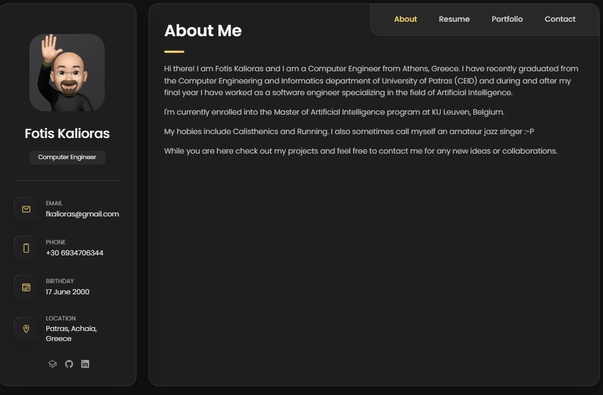
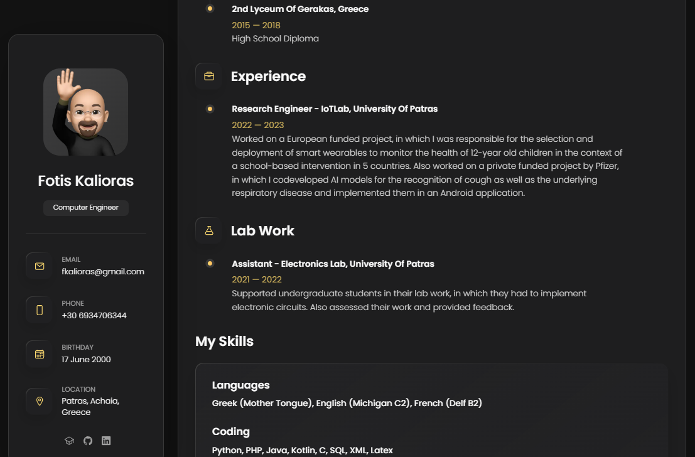
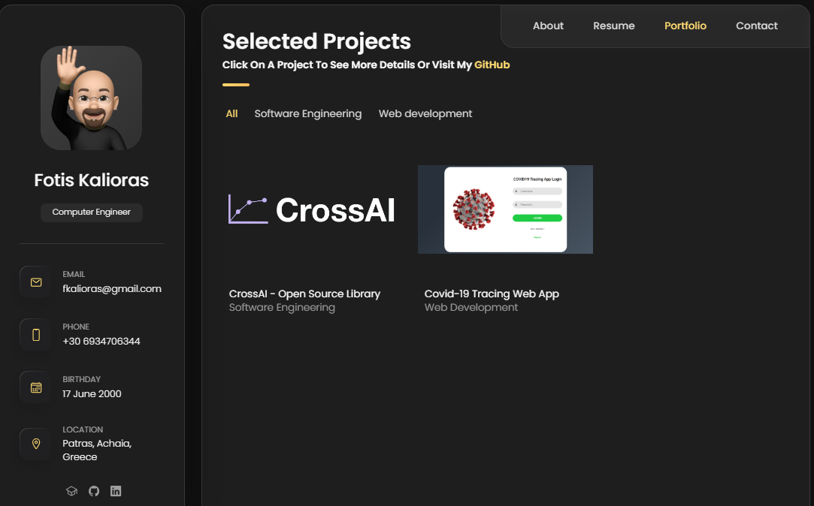
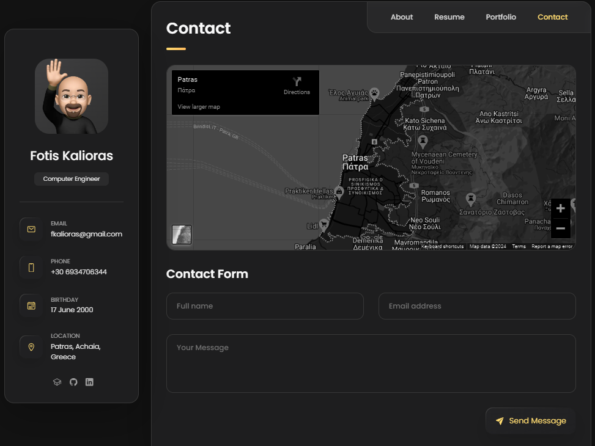

# modified vCard - Personal portfolio

modified vCard is a fully responsive personal portfolio website, responsive for all devices, built using HTML, CSS, and JavaScript. It is based on the original vCard template by [Codewitsadee](https://github.com/codewithsadee/vcard-personal-portfolio) but it is modified to be more manageable and more suitable for a software engineer.

More specifically, the following changes have been made:
- The original template was a single page website. The modified version retains the single HTML approach but JS files are used to populate the projects and resume sections.
- Each JS file contains at the top a JSON object with the data for the projects and resume sections. This way, the data is separated from the HTML and can be easily modified.
- The skills section in the resume has been modified to have a list of skills rather than a progress bar. 
- The JS and CSS files are minified, reducing their size.
- The blog page HTML and CSS have been removed.
- The projects section has been modified to include a modal for each project. The modal contains a description of the project and a link to the project's site.
- The testimonials section and the relevant modal HTML and CSS has been removed. 

## Screenshots

 

## Prerequisites

Before you begin, ensure you have met the following requirements:

* [Git](https://git-scm.com/downloads "Download Git") must be installed on your operating system.

## Contact

If you want to contact me you can reach me at [my email](mailto:fkalioras@gmail.com).

## License

MIT
